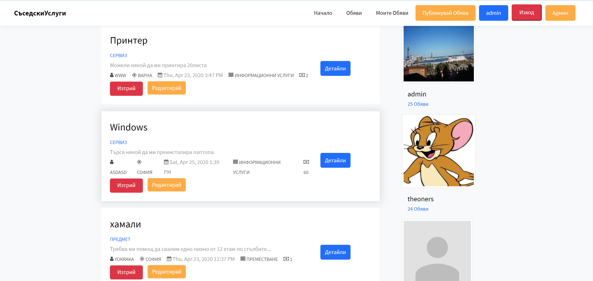
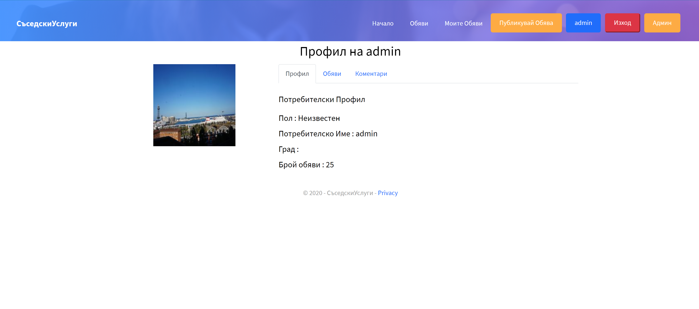
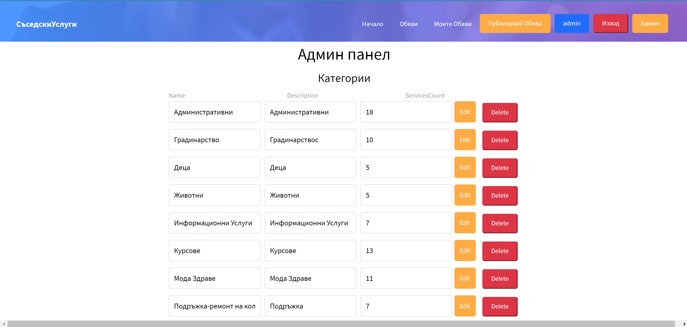
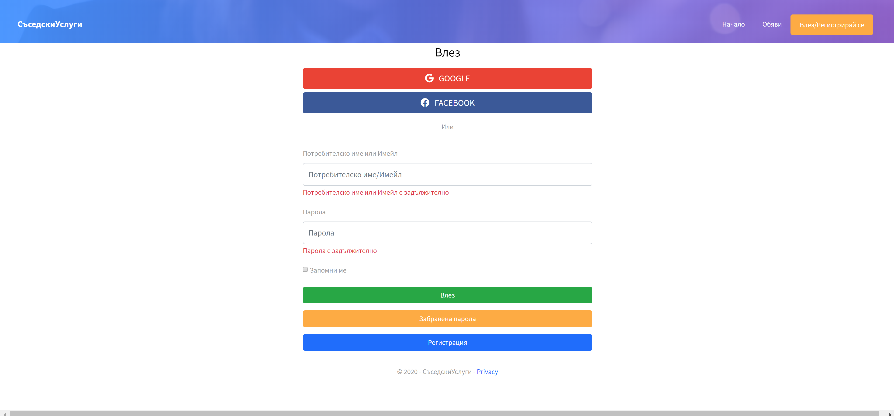

# NeighbourhoodServices
ASP.NET Core - Final Project
https://neighbourhoodservices.azurewebsites.net/
* NeighbourhoodServices 
## Using ASP.NET Core 3.1 Template by : Nikolay Kostov https://github.com/NikolayIT/ASP.NET-MVC-Template

### Technologies used:
* .NET Core 3.1
* ASP .NET Core 3.1
* Entity Framework Core 3.1
* Blazor
* xUnit
* JavaScript
* jQuery
* Bootstrap
* HTML 5
* CSS
* Cloudinary
* SendGrid

### Dependencies:
* [Cloudinary](https://www.cloudinary.com/)
* [SendGrid](https://www.sendgrid.com/)

## Screen Shots:

